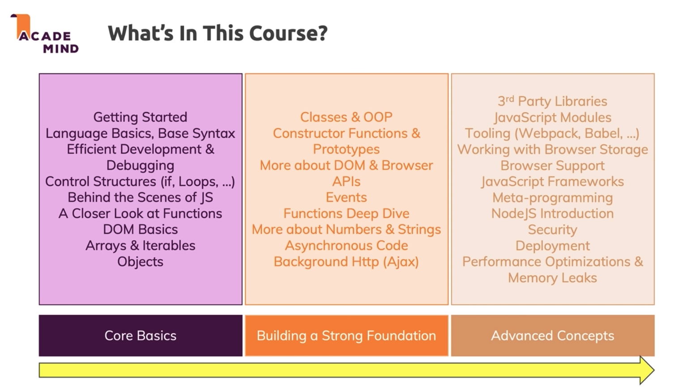

### The Introduction of the Course

### What is JavaScript?

> JavaScript is a dynamic, weakly-typed, interpreted programming language, it can run in different environment, such as browser or server, and it is compiled at runtime.

> JavaScript codes run on a single thread.

### How does JavaScript execute?

> JavaScript codes will effect on webpages by JavaScript engine which is built into the browser. The job of the JavaScript engine is to read the codes, understands the codes, then compile the codes to the machine code, and then execute the machien codes.

### What does **DYNAMIC** mean?

> Dynamic means not pre-compiled. That means the codes evaluate and execute at runtime, and it can change at runtime.

### What does **WEAKLY_TYPED PROGRAMMING LANGUAGE** mean?

> Weakly-typed means that you don't need to tell the code what type of data you are working with, instead, data types are assumed and inferred automatically.

> When define some variables, yon don't have to tell that those variables will hold a certain number.

> Data types are not set in the stone but can change at rumtime.

### The difference between JavaScript and Node.js

> JavaScript can not access the local filesystem, or interact with the operating system. It can manipulate HTML or CSS.

> Node.js can access the local filesystem, and interact with the operating system. It can not manipuate HTML or CSS.

---

### Basic Syntax & Features
